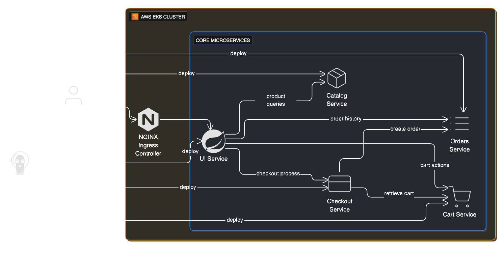
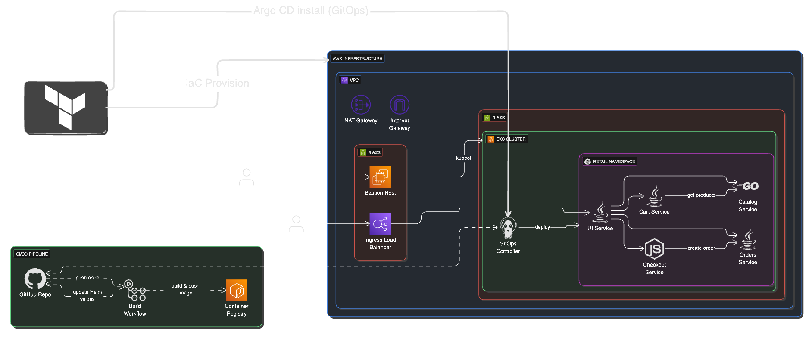
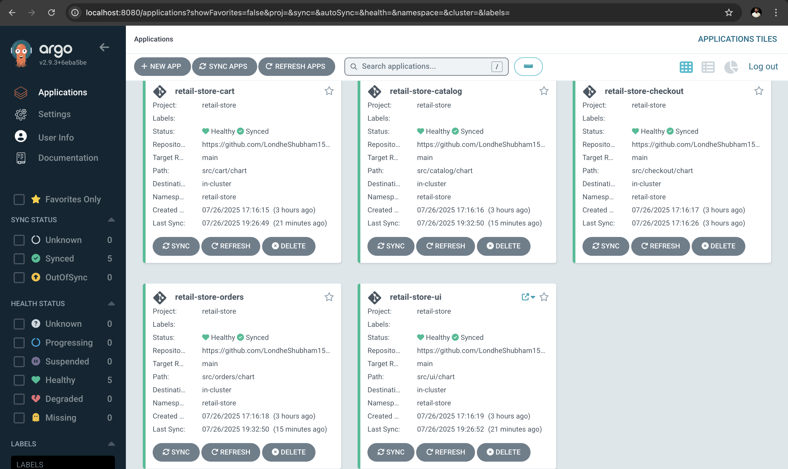

# Retail Store Sample App - GitOps with Amazon EKS Auto Mode


<div align="center">
  <div align="center">

[](Stars)


  </div>

  <strong>
  <h2>AWS Containers Retail Sample</h2>
  </strong>
</div>

This is a sample application designed to illustrate various concepts related to containers on AWS. It presents a sample retail store application including a product catalog, shopping cart and checkout, deployed using modern DevOps practices including GitOps and Infrastructure as Code.

## Table of Contents

- [Overview](#overview)
- [Architecture](#architecture)
- [Prerequisites](#prerequisites)
- [Quick Start](#quick-start)
- [Branch Strategy](#branch-strategy)
- [Getting Started](#getting-started)
- [GitOps Workflow](#gitops-workflow)
- [EKS Auto Mode](#eks-auto-mode)
- [Infrastructure Components](#infrastructure-components)
- [CI/CD Pipeline](#cicd-pipeline)
- [Monitoring and Observability](#monitoring-and-observability)
- [Cleanup](#cleanup)
- [Troubleshooting](#troubleshooting)

## Overview

The Retail Store Sample App demonstrates a modern microservices architecture deployed on AWS EKS using GitOps principles. The application consists of multiple services that work together to provide a complete retail store experience:



- **UI Service**: Java-based frontend
- **Catalog Service**: Go-based product catalog API
- **Cart Service**: Java-based shopping cart API
- **Orders Service**: Java-based order management API
- **Checkout Service**: Node.js-based checkout orchestration API

## Infrastructure Architecture



The Infrastructure Architecture follows cloud-native best practices:

- **Microservices**: Each component is developed and deployed independently
- **Containerization**: All services run as containers on Kubernetes
- **GitOps**: Infrastructure and application deployment managed through Git
- **Infrastructure as Code**: All AWS resources defined using Terraform
- **CI/CD**: Automated build and deployment pipelines with GitHub Actions

## Quick Start

**Want to deploy immediately?** Follow these steps for a basic deployment:

1. **Install Prerequisites**: AWS CLI, Terraform, kubectl, Docker, Helm
2. **Configure AWS**: `aws configure` with appropriate credentials
3. **Clone Repository**: `git clone https://github.com/LondheShubham153/retail-store-sample-app.git`
4. **Deploy Infrastructure**: Run Terraform in two phases (see [Getting Started](#getting-started))
5. **Access Application**: Get load balancer URL and browse the retail store

**Need advanced GitOps workflow?** See [BRANCHING_STRATEGY.md](./BRANCHING_STRATEGY.md) for automated CI/CD setup.

## Branch Strategy

This repository uses a **dual-branch approach** for different deployment scenarios:

### 🌐 **Public Application (Main Branch)**
- **Purpose**: Simple deployment with public images
- **Images**: Public ECR (stable versions like v1.2.2)
- **Deployment**: Manual control with umbrella chart
- **Updates**: Manual only
- **Best for**: Demos, learning, quick testing, simple deployments

### 🏭 **Production (GitOps Branch)**
- **Purpose**: Full production workflow with CI/CD pipeline
- **Images**: Private ECR (auto-updated with commit hashes)
- **Deployment**: Automated via GitHub Actions
- **Updates**: Automatic on code changes
- **Best for**: Production environments, automated workflows, enterprise deployments

> **📚 For detailed branching strategy, CI/CD setup, and advanced workflows, see [BRANCHING_STRATEGY.md](./BRANCHING_STRATEGY.md)**

## Prerequisites

Before you begin, ensure you have the following tools installed:

- **AWS CLI** (configured with appropriate credentials)
- **Terraform** (version 1.0.0 or later)
- **kubectl** (compatible with Kubernetes 1.23+)
- **Git** (2.0.0 or later)
- **Docker** (for local development)
- **Helm** 

## Getting Started

Follow these steps to **install Prerequisites:**

- #### 1. AWS CLI:

  * These commands will download and install the **AWS Command Line Interface**.

```sh
curl "https://awscli.amazonaws.com/awscli-exe-linux-x86_64.zip" -o "awscliv2.zip"
unzip awscliv2.zip
sudo ./aws/install

# Verify the installation
aws --version
```

- #### 2. Terraform:

  - **Terraform** is installed by downloading the binary appropriate for your operating system.

    - <details>
      <summary><strong>Click for Linux & macOS Instructions</strong></summary>

      1.  **Download the Binary**: Go to the [Terraform Downloads Page](https://releases.hashicorp.com/terraform/1.12.2) to find the correct zip file for your system (e.g., Linux AMD64, macOS ARM64).

      2.  **Install the Binary**: Unzip the file and move the `terraform` executable to a directory in your system's PATH.

        ```sh
        # Example for a downloaded file
        unzip terraform_1.9.0_linux_amd64.zip
        sudo mv terraform /usr/local/bin/
        ```
        or
        ```sh
        # Example for macOS
        brew install terraform
        ```
      3.  **Verify the Installation**:
     
        ```sh
        terraform --version
        ```
      </details>
  
    - <details>
      <summary><strong>Click for Windows Instructions</strong></summary>
  
        * **Official Guide:** [Install Terraform on Windows](https://developer.hashicorp.com/terraform/install)
    
      </details>

- #### 3. kubectl:

  * These commands install a specific version of **kubectl**.

    - <details>
      <summary><strong>Click for macOS Instructions</strong></summary>
  
        ```sh
        # Download the kubectl binary
        curl -LO "https://dl.k8s.io/release/v1.33.3/bin/darwin/arm64/kubectl"

        # Make the binary executable
        chmod +x ./kubectl

          # Move the binary into your PATH
        sudo mv ./kubectl /usr/local/bin/kubectl
        ```

      </details>

    - <details>
      <summary><strong>Click for Linux Instructions</strong></summary>
  
      ```sh
      # Download the kubectl binary
      curl -LO "https://dl.k8s.io/release/v1.33.3/bin/linux/amd64/kubectl"
  
      # Make the binary executable
      chmod +x ./kubectl

      # Move the binary into your PATH
      sudo mv ./kubectl /usr/local/bin/kubectl
      ```
      
      </details>

- #### [4. Docker](https://docs.docker.com/desktop/setup/install/linux/):

  - > **Step 1: Set Up the Repository:**

    ```sh
    sudo apt-get update
    sudo apt-get install \
        ca-certificates \
        curl \
        gnupg
    ```

  - > **Step 2: Add Docker’s Official GPG Key:**

    ```sh
    sudo install -m 0755 -d /etc/apt/keyrings
    curl -fsSL https://download.docker.com/linux/ubuntu/gpg | sudo gpg --dearmor -o /etc/apt/keyrings/docker.gpg
    sudo chmod a+r /etc/apt/keyrings/docker.gpg
    ```
  
  - > **Step 3: Set Up the Docker Repository:**

    ```sh
    echo \
      "deb [arch=$(dpkg --print-architecture) signed-by=/etc/apt/keyrings/docker.gpg] https://download.docker.com/linux/ubuntu \
      $(. /etc/os-release && echo "$VERSION_CODENAME") stable" | \
      sudo tee /etc/apt/sources.list.d/docker.list > /dev/null
    ```


  - > **Step 4: Install Docker Engine:**
    
    ```sh
    sudo apt-get update
    sudo apt-get install docker-ce docker-ce-cli containerd.io docker-buildx-plugin docker-compose-plugin

    # Verify the installation
    docker --version
    ```

- #### 5. Helm:
  
    ```sh
    curl -fsSL -o get_helm.sh https://raw.githubusercontent.com/helm/helm/main/scripts/get-helm-3
    chmod 700 get_helm.sh
    ./get_helm.sh --version v3.18.4
    ```


Follow these steps to deploy the application:

### Step 1. Configure AWS with **`Root User`** Credentials:

  Ensure your AWS CLI is configured with the **Root user credentials:**

```sh
aws configure
```

### Step 2. Clone the Repository:

```sh
git clone https://github.com/LondheShubham153/retail-store-sample-app.git
cd retail-store-sample-app
```

> [!IMPORTANT]
> ### Step 3: Choose Your Deployment Strategy
>
> **For Public Application (Main Branch):**
> - Uses stable public ECR images (v1.2.2)
> - Manual deployment control
> - No GitHub Actions required
> - Skip to Step 4 - infrastructure is ready
>
> **For Production (GitOps Branch):**
> - Uses private ECR with automated CI/CD
> - Requires GitHub Actions setup
> - See [BRANCHING_STRATEGY.md](./BRANCHING_STRATEGY.md) for complete setup
>
> ### GitHub Actions Setup (Production Branch Only):
> 
> If using the Production branch, configure these secrets in your GitHub repository:
> 
> | Secret Name           | Value                              |
> |-----------------------|------------------------------------|
> | `AWS_ACCESS_KEY_ID`   | `Your AWS Access Key ID`           |
> | `AWS_SECRET_ACCESS_KEY` | `Your AWS Secret Access Key`     |
> | `AWS_REGION`          | `region-name`                       |
> | `AWS_ACCOUNT_ID`        | `your-account-id` |


### Step 4. Deploy Infrastructure with Terraform:

The deployment is split into two phases for better control:


### Phase 1 of Terraform: Create EKS Cluster 

In Phase 1: Terraform Initialises and creates resources within the retail_app_eks module. 

```sh
cd retail-store-sample-app/terraform/
terraform init
terraform apply -target=module.retail_app_eks -target=module.vpc --auto-approve
```


This creates the core infrastructure, including:
- VPC with public and private subnets
- Amazon EKS cluster with Auto Mode enabled
- Security groups and IAM roles
  

### Step 6: Update kubeconfig to Access the Amazon EKS Cluster:
```
aws eks update-kubeconfig --name retail-store --region <region>
```

### Phase 2 of Terraform: Once you update kubeconfig, apply the Remaining Configuration:


```bash
terraform apply --auto-approve
```

This deploys:
- ArgoCD for Setup GitOps
- NGINX Ingress Controller
- Cert Manager for SSL certificates

### Step 7: GitHub Actions (Production Branch Only)

> **Note**: This step is only required if you're using the **Production branch** for automated deployments. Skip this step if using the **Public Application branch** for simple deployment.

For GitHub Actions, first configure secrets so the pipelines can be automatically triggered:

**Create an IAM User, policies, and generate credentials**

**Go to your GitHub repo → Settings → Secrets and variables → Actions → New repository secret.**


| Secret Name           | Value                              |
|-----------------------|------------------------------------|
| `AWS_ACCESS_KEY_ID`   | `Your AWS Access Key ID`           |
| `AWS_SECRET_ACCESS_KEY` | `Your AWS Secret Access Key`     |
| `AWS_REGION`          | `region-name`                       |
| `AWS_ACCOUNT_ID`        | `your-account-id` |


> [!IMPORTANT]
> Once the entire cluster is created, any changes pushed to the repository will automatically trigger GitHub Actions.

GitHub Actions will automatically build and push the updated Docker images to Amazon ECR.


### Verify Deployment

Check if the nodes are running:

```bash
kubectl get nodes
```

### Step 8: Access the Application:

The application is exposed through the NGINX Ingress Controller. Get the load balancer URL:

```bash
kubectl get svc -n ingress-nginx
```

Use the EXTERNAL-IP of the ingress-nginx-controller service to access the application.


### Step 9: Argo CD Automated Deployment:

**Verify ArgoCD installation**

```
kubectl get pods -n argocd
```


### Step 10: Port-forward to Argo CD UI and login:

**Get ArgoCD admin password**
```
kubectl -n argocd get secret argocd-initial-admin-secret -o jsonpath='{.data.password}' | base64 -d
```

**Port-forward to Argo CD UI**
```
kubectl port-forward svc/argocd-server -n argocd 8080:443 &
```

Open your browser and navigate to:
https://localhost:8080

Username: admin 

Password: <output of previous command>

### Step 10: Access ArgoCD UI

Once ArgoCD is deployed, you can access the web interface:



The ArgoCD UI provides:
- **Application Status**: Real-time sync status of all services
- **Resource View**: Detailed view of Kubernetes resources
- **Sync Operations**: Manual sync and rollback capabilities
- **Health Monitoring**: Application and resource health status

### Step 11: Monitor Application Deployment

```bash
kubectl get pods -n retail-store
kubectl get ingress -n retail-store
```

### Step 12: Cleanup

To delete all resources created by Terraform:


**For Phase 1: Run this command**

```bash
terraform destroy -target=module.retail_app_eks --auto-approve
```

**For Phase 2: Run this command**
```
terraform destroy --auto-approve
```


> [!NOTE]
> Only ECR Repositories you need to Delete it from AWS Console Manually.


## Troubleshooting

### Common Issues

#### **Image Pull Errors**
```
Error: Failed to pull image "123456789012.dkr.ecr.us-west-2.amazonaws.com/retail-store-ui:abc1234"
```
**Solutions**:
1. Ensure you're using the correct branch for your deployment strategy
2. For Production branch: Check GitHub Actions completed successfully
3. For Public Application branch: Verify you're using public ECR images
4. Check AWS credentials and ECR permissions

#### **GitHub Actions Not Triggering**
**Solutions**:
1. Ensure changes are in `src/` directory
2. Verify you're on the `production` branch (gitops)
3. Check GitHub Actions is enabled in repository settings
4. Review [BRANCHING_STRATEGY.md](./BRANCHING_STRATEGY.md) for detailed setup

### Getting Help

- **Basic deployment issues**: Check this README
- **Advanced GitOps issues**: See [BRANCHING_STRATEGY.md](./BRANCHING_STRATEGY.md)
- **Infrastructure issues**: Review Terraform logs
- **Application issues**: Check ArgoCD UI and kubectl logs

## License

This project is licensed under the Apache License 2.0 - see the [LICENSE](./LICENSE) file for details.
