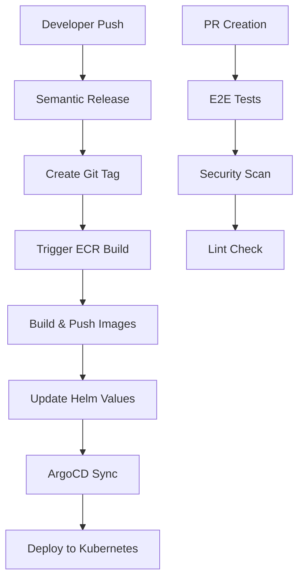

# Unified CI/CD Workflow & Industry-Standard Container Tagging

## 🎯 **Overview**

This document describes the unified CI/CD workflow and industry-standard container tagging strategy implemented for the Retail Store Sample Application. The workflow ensures consistent tagging across all environments and enables seamless ArgoCD deployments.

## 🏗️ **Architecture**



## 🏷️ **Industry-Standard Tagging Strategy**

### **Tag Types Applied to All Images:**

| Tag Type | Format | Example | Purpose |
|----------|---------|---------|---------|
| **Semantic Version** | `v{major}.{minor}.{patch}` | `v1.2.3` | Production releases |
| **Git Commit** | `git-{short-sha}` | `git-a1b2c3d` | Exact traceability |
| **Build ID** | `build-{run-number}` | `build-1234` | CI/CD correlation |
| **Branch** | `{branch-name}` | `main`, `feature-xyz` | Environment correlation |
| **Combined** | `{branch}-{short-sha}` | `main-a1b2c3d` | **PRIMARY for ArgoCD** |
| **Latest** | `latest` | `latest` | Main branch only |

### **Dynamic Versioning Logic:**

```bash
# If on tagged commit
VERSION=$(git describe --tags --exact-match)

# If not on tagged commit
LATEST_TAG=$(git describe --tags --abbrev=0 || echo "v0.0.0")
COMMITS_SINCE=$(git rev-list --count ${LATEST_TAG}..HEAD)
VERSION="${major}.${minor}.${patch}-${COMMITS_SINCE}.${git-commit}"
```

## 🔄 **Workflow Triggers**

### **1. Main Branch Push (Production)**
```yaml
Trigger: Push to main
Flow: Semantic Release → ECR Build → Helm Update → ArgoCD Deploy
Tags: All industry-standard tags applied
Primary Tag: main-{git-commit}
```

### **2. Pull Request (Testing)**
```yaml
Trigger: PR creation/update
Flow: E2E Tests → Security Scan → Lint Check
Tags: e2e-{git-commit}
Purpose: Validation only
```

### **3. Manual Trigger**
```yaml
Trigger: workflow_dispatch
Flow: Direct ECR Build → Helm Update
Tags: All industry-standard tags applied
Purpose: Emergency deployments
```

## 📦 **ECR Repository Structure**

```
565393041505.dkr.ecr.eu-west-1.amazonaws.com/
├── retail-store-sample-cart
├── retail-store-sample-catalog
├── retail-store-sample-checkout
├── retail-store-sample-orders
└── retail-store-sample-ui
```

### **Security Features:**
- ✅ Image scanning enabled (`scanOnPush=true`)
- ✅ AES256 encryption
- ✅ Lifecycle policies for cleanup
- ✅ Immutable image tags

## 🎛️ **Workflow Files**

### **1. Semantic Release** (`.github/workflows/semantic-release.yml`)
- **Purpose**: Creates semantic version tags based on conventional commits
- **Triggers**: Push to main
- **Output**: Git tags, changelog, GitHub releases

### **2. ECR Build** (`.github/workflows/private-ecr-build.yaml`)
- **Purpose**: Builds and pushes Docker images to ECR
- **Triggers**: Semantic release, manual, repository dispatch
- **Features**: Dynamic versioning, industry-standard tagging, Helm updates

### **3. E2E Tests** (`.github/workflows/e2e-test-simple.yml`)
- **Purpose**: End-to-end testing using Kind cluster
- **Triggers**: Push to main, PR creation
- **Features**: Consistent tagging, ECR integration

### **4. Security Scan** (`.github/workflows/security-scan-simple.yml`)
- **Purpose**: Vulnerability scanning with Trivy
- **Triggers**: Push to main, PR creation
- **Features**: Container and filesystem scanning

### **5. Helm Update** (`.github/workflows/update-helm-values.yml`)
- **Purpose**: Updates Helm values with new image tags
- **Triggers**: Repository dispatch from ECR build
- **Features**: Dynamic versioning, atomic commits

## 🚀 **ArgoCD Integration**

### **Application Configuration:**
```yaml
apiVersion: argoproj.io/v1alpha1
kind: Application
metadata:
  name: retail-store-app
spec:
  source:
    repoURL: https://github.com/iemafzalhassan/retail-store-sample-app
    targetRevision: main
    path: src/app
  syncPolicy:
    automated:
      prune: true
      selfHeal: true
```

### **Deployment Strategy:**
1. **Helm values updated** with `main-{git-commit}` tag
2. **Git commit** creates immutable reference
3. **ArgoCD detects** changes automatically
4. **Sync process** deploys new images
5. **Health checks** validate deployment

## 🛠️ **Local Development**

### **Build Script Usage:**
```bash
# Build and tag locally
./scripts/build-and-tag.sh

# Build, tag, and push to ECR
./scripts/build-and-tag.sh --push

# Build with custom version
VERSION=1.2.0 ./scripts/build-and-tag.sh --push
```

### **Testing Locally:**
```bash
# Run E2E tests locally
cd src/app
docker compose up --build -d

# Check health endpoints
curl http://localhost:8888/health
```

## 📝 **Conventional Commits**

To trigger semantic releases, use conventional commit messages:

```bash
# Patch release (1.0.0 → 1.0.1)
git commit -m "fix: resolve cart calculation bug"

# Minor release (1.0.0 → 1.1.0)
git commit -m "feat: add product search functionality"

# Major release (1.0.0 → 2.0.0)
git commit -m "feat!: redesign checkout API

BREAKING CHANGE: checkout endpoint now requires authentication"
```

## 🔍 **Monitoring & Troubleshooting**

### **Check Image Tags in ECR:**
```bash
aws ecr describe-images \
  --repository-name retail-store-sample-cart \
  --region eu-west-1 \
  --query 'imageDetails[*].imageTags'
```

### **Verify Helm Values:**
```bash
cat src/cart/chart/values.yaml | grep -A 3 "image:"
```

### **ArgoCD Sync Status:**
```bash
kubectl get applications -n argocd
kubectl describe application retail-store-app -n argocd
```

## 🎯 **Benefits**

### **✅ Consistency**
- Same tagging across all environments
- Unified workflow for all services
- Predictable deployment process

### **✅ Traceability**
- Git commit linked to every deployment
- Build ID for CI/CD correlation
- Semantic versions for release management

### **✅ Reliability**
- Immutable image tags
- Automated health checks
- Rollback capabilities

### **✅ Security**
- Image vulnerability scanning
- Encrypted container storage
- Non-root container execution

## 🚀 **Deployment Flow Example**

```bash
# 1. Developer creates feature
git checkout -b feature/new-search
git commit -m "feat: add product search API"
git push origin feature/new-search

# 2. PR triggers validation
# - E2E tests run with e2e-{commit} tags
# - Security scans validate containers
# - Lint checks pass

# 3. PR merged to main
git checkout main
git merge feature/new-search

# 4. Semantic release creates tag
# - Analyzes commits since last release
# - Creates v1.1.0 tag and GitHub release
# - Triggers ECR build workflow

# 5. ECR build creates images
# - Builds with tags: v1.1.0, git-a1b2c3d, main-a1b2c3d, etc.
# - Pushes to ECR repositories
# - Updates Helm values with main-a1b2c3d

# 6. ArgoCD deploys automatically
# - Detects Helm values change
# - Syncs new images to Kubernetes
# - Validates deployment health
```

This unified workflow ensures reliable, traceable, and secure deployments while maintaining industry best practices for container management and CI/CD automation. 